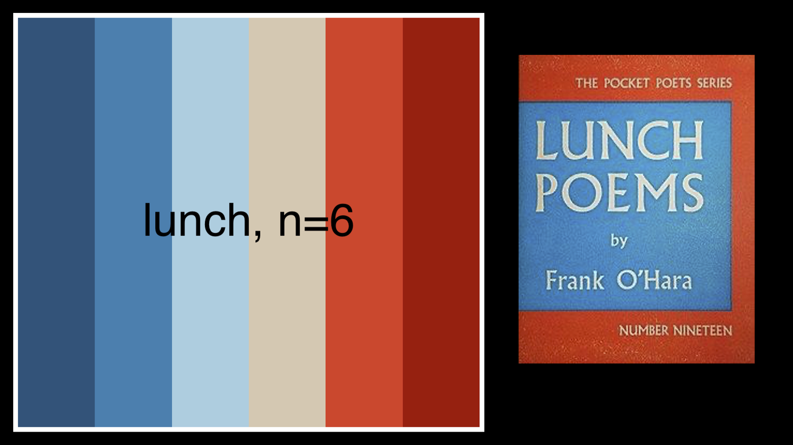

# PLColors
Color palette package in R inspired by classic books found at your local public library 

[Installation](#install-package)  
[Palettes](#palettes)  


## Install Package
```r
install.packages("devtools") 
devtools::install_github("lampoona/PLColors") 
```

## Usage

```r
library(PLColors)

names(pl_palettes)
[1] "pride"        "gatsby"       "gatsby2"      "catcher"      "lotr"     
[6] "tender"       "anna"         "TKAM"         "TKAM2"        "peter"     
[11] "farewell"     "feast"        "orange"       "lunch"       "solitude"  
[16] "dalloway"     "huck"         "lotf"         "cuckoo"      "dune"      
[21] "prince"       "war"          "harry"        "lorax"       "foundations" 
[26] "boc"          "master"       "alice"        "fountainhead" "pi"        
[31] "hobbit"       "matilda"      "road"          
 ```


## Palettes


  - Alice in Wonderland - by Lewis Carroll
  
***


  - Anna Karenina - by Leo Tolstoy
  
***


  - Breakfast of Champions - Kurt Vonnegut
  
***


  - Catcher in the Rye - J.D. Salinger
  
***


  - One Flew Over the Cuckoo's Nest - Ken Kesey
  
***


  - Mrs. Dalloway - Virginia Woolf
  
***


  - Dune - Frank Herbert
  
***


  - A Farewell to Arms - Ernest Hemingway 
  
***


  - A Moveable Feast - Ernest Hemingway 
  
***


  - Foundations - Isaac Asimov
  
***


  - The Great Gatbsy - F. Scott Fitzgerald
  
***


  - The Great Gatbsy - F. Scott Fitzgerald
  
***


  - Harry Potter and the Sorcerer's Stone - J.K. Rowling
  
***


  - The Hobbit - J.R.R. Tolkien
  
***


  - The Lord of the Rings Trilogy - J.R.R. Tolkien
  
***


- Huckleberry Finn - Mark Twain

***


  - The Lorax - Dr. Seuss 
  
***


  - Lord of the Flies - William Golding
  
***



  - Lunch Poems - Frank O'Hara
  
***


  - The Master and Margarita - Mikhail Bulgakov
  
***


  - Matilda - Roald Dahl
  
***


  - A Clockwork Orange - Anthony Burgess 
  
***


  - Peter Pan - J.M. Barrie 
  
***


  - Life of Pi - Yann Martel 
  
***


  - Pride and Prejudice - Jane Austen 
  
***


  - The Little Prince - Antoine de Saint-Exupery
  
***


  - On the Road - Jack Kerouac 
  
***


  - One Hundred Years of Solitude - Gabriel Garcia Marquez 
  
***


  - Tender is the Night - F. Scott Fitzgerald 
  
***


  - To Kill a Mockingbird - Harper Lee 
  
***


  - To Kill a Mockingbird - Harper Lee 
  
***


  - War and Peace - Leo Tolstoy
  
***


## Building Palettes 

Use the `pl_palette()` function to build and view palettes. Inputs are 'name', 'n', and 'type' (continuous or discrete). 'Name' is required. If 'n' is blank, function will assume n is equal to the number of colors in the palette (5-6), but if n > palette length, it will automatically interpolate colors between. If 'type' is missing, the function will assume "discrete" if n < palette length, and "continuous" if n > palette length. 

```r
pl_palette(name="anna",n=10,type="continuous")
```


```r
pl_palette("tender",100)
```


```r
pl_palette("pride",n=4)
```


```r
pnw_palette("huck",20)
```


